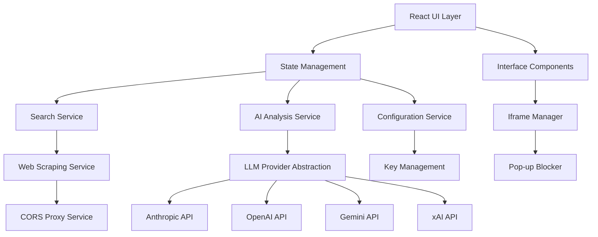

# Design Document

## Overview

Agatha is a client-side React application built with TypeScript that provides an intelligent web interface for discovering and exploring relevant websites. The system uses AI-powered analysis to rank websites by relevance and presents them in an immersive horizontal card interface inspired by Minority Report. The architecture emphasizes client-side processing, user-controlled API keys, and extensible LLM provider support.

## Architecture

### High-Level Architecture



### Core Services Architecture

The application follows a service-oriented architecture with clear separation of concerns:

- **UI Layer**: React components with TypeScript
- **State Management**: Context API or Zustand for global state
- **Service Layer**: Modular services for different functionalities
- **Provider Abstraction**: Unified interface for different LLM providers

## Components and Interfaces

### Core Interfaces

```typescript
interface SearchResult {
  id: string;
  url: string;
  title: string;
  description: string;
  relevanceScore: number;
  confidenceScore: number;
  timestamp: Date;
  metadata: {
    domain: string;
    contentType: string;
    loadStatus: 'loading' | 'loaded' | 'error';
  };
}

interface SearchQuery {
  prompt: string;
  maxResults: number;
  filters?: {
    domains?: string[];
    contentTypes?: string[];
    dateRange?: DateRange;
  };
}

interface LLMProvider {
  name: string;
  models: string[];
  apiKey?: string;
  baseUrl: string;
  rateLimit: {
    requestsPerMinute: number;
    tokensPerMinute: number;
  };
}

interface AnalysisRequest {
  content: string;
  prompt: string;
  provider: LLMProvider;
  model: string;
}

interface AnalysisResponse {
  relevanceScore: number;
  confidenceScore: number;
  description: string;
  reasoning: string;
}
```

### Component Hierarchy

```
App
├── ConfigurationPanel
│   ├── ProviderSettings
│   └── APIKeyManager
├── SearchInterface
│   ├── SearchInput
│   └── SearchFilters
├── ResultsDisplay
│   ├── HorizontalCardContainer
│   │   ├── ResultCard[]
│   │   └── CardNavigation
│   └── IframeViewer
│       ├── IframeContainer
│       └── PopupBlocker
└── StatusIndicator
    ├── LoadingStates
    └── ErrorDisplay
```

### Key Components

#### HorizontalCardContainer
- Implements smooth horizontal scrolling
- Manages card positioning and transitions
- Handles keyboard and mouse navigation
- Responsive design for different screen sizes

#### ResultCard
- Displays website preview and metadata
- Shows relevance and confidence scores
- Provides quick actions (open, analyze, bookmark)
- Implements hover and selection states

#### IframeViewer
- Manages iframe loading and security
- Implements pop-up blocking strategies
- Handles cross-origin restrictions
- Provides fallback for blocked content

#### PopupBlocker
- Detects common pop-up patterns
- Injects CSS to hide overlays
- Monitors DOM changes for dynamic pop-ups
- Provides user controls for manual blocking

## Data Models

### Search State Management

```typescript
interface AppState {
  search: {
    query: SearchQuery | null;
    results: SearchResult[];
    status: 'idle' | 'searching' | 'analyzing' | 'complete' | 'error';
    error: string | null;
  };
  ui: {
    selectedResult: string | null;
    cardPosition: number;
    viewMode: 'cards' | 'iframe' | 'split';
    theme: 'light' | 'dark';
  };
  configuration: {
    providers: LLMProvider[];
    activeProvider: string;
    activeModel: string;
    preferences: UserPreferences;
  };
}
```

### Content Analysis Pipeline

1. **Content Extraction**: Extract text content from web pages
2. **Preprocessing**: Clean and normalize content
3. **AI Analysis**: Send to configured LLM provider
4. **Score Calculation**: Process AI response into numerical scores
5. **Ranking**: Sort results by relevance score

## Error Handling

### Error Categories

1. **Network Errors**: Failed web requests, CORS issues
2. **API Errors**: LLM provider failures, rate limiting
3. **Content Errors**: Unloadable iframes, blocked content
4. **Configuration Errors**: Invalid API keys, missing settings

### Error Handling Strategy

```typescript
interface ErrorHandler {
  handleNetworkError(error: NetworkError): void;
  handleAPIError(error: APIError): void;
  handleContentError(error: ContentError): void;
  handleConfigurationError(error: ConfigurationError): void;
}
```

- **Graceful Degradation**: Continue operation with reduced functionality
- **User Feedback**: Clear error messages with actionable suggestions
- **Retry Logic**: Automatic retry with exponential backoff
- **Fallback Options**: Alternative providers or manual overrides

## Testing Strategy

### Unit Testing
- Component testing with React Testing Library
- Service layer testing with Jest
- Mock LLM provider responses
- Test error handling scenarios

### Integration Testing
- End-to-end user workflows
- API integration testing
- Cross-browser compatibility
- Performance testing under load

### Testing Structure
```
src/
├── components/
│   └── __tests__/
├── services/
│   └── __tests__/
├── utils/
│   └── __tests__/
└── __tests__/
    ├── integration/
    └── e2e/
```

### Key Test Scenarios
1. Search flow from prompt to results
2. LLM provider switching and fallback
3. Iframe loading and pop-up blocking
4. Error handling and recovery
5. Configuration management
6. Responsive UI behavior

## Security Considerations

### Client-Side Security
- API key storage in secure browser storage
- Content Security Policy for iframe safety
- Input sanitization for search queries
- Rate limiting to prevent abuse

### Cross-Origin Handling
- CORS proxy service for web scraping
- Iframe sandbox attributes
- Content validation before display
- Fallback for blocked content

## Performance Optimization

### Lazy Loading
- Defer iframe loading until card is selected
- Progressive image loading for previews
- Code splitting for provider modules

### Caching Strategy
- Cache search results locally
- Store AI analysis results
- Implement cache invalidation policies
- Optimize for offline usage

### Resource Management
- Limit concurrent API requests
- Implement request queuing
- Monitor memory usage for iframes
- Clean up unused resources